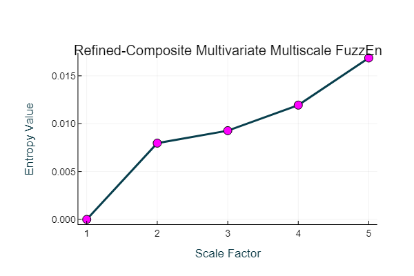

# Example 12: [Generalized] Refined-composite Multivariate Multiscale Fuzzy Entropy

Import the x, y, and z components of the Lorenz system of equations.

```
Data = ExampleData("lorenz");

using Plots
scatter(Data[:,1], Data[:,2], Data[:,3],
markercolor = "green", markerstrokecolor = "black",
markersize = 3, background_color = "black", grid = false)
```


Create a multiscale entropy object with the following parameters:
EnType =  MvFuzzEn(), fuzzy membership function = 'constgaussian', fuzzy function parameter = 1.75, normalized data to unit variance = true.

```@example
using EntropyHub # hide
Mobj = MSobject(MvFuzzEn, Fx = "constgaussian", r = 1.75, Norm = true)
```

Calculate the generalized refined-composite multivariate multiscale fuzzy entropy over 5 scales and plotting the output.

!!! tip 

    When the multivariate entropy method is multivariate fuzzy entropy (``MvFuzzEn``), **cMvMSEn** by default employs a generalized graining procedure
    with the standard deviation (not the variance like in MvMSEn). This follows the method presented in [1].
    
    [1] Azami, Fernández and Escudero.
    " *Refined multiscale fuzzy entropy based on standard deviation for biomedical signal analysis* "
    Medical & biological engineering & computing 55 (2017): 2037-2052

!!! warning

    As with conventional generalized multiscale entropy, the multiscale entropy value for the first scale will always == 0, as the variance or 
    standard deviation of a singular value is 0!

```@example
using EntropyHub # hide
Data = ExampleData("lorenz"); # hide
Mobj = MSobject(MvFuzzEn, Fx = "constgaussian", r = 1.75, Norm = true) # hide
MSx, CI = cMvMSEn(Data, Mobj, Scales = 5, Refined = true, Plotx = true)
```



